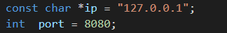

# C2 Server

### Specify the appropriate IP address and port number.


## compile

```
Linux:
i686-w64-mingw32-g++ -std=c++11 payload.cpp -o payload.exe -s -lws2_32 -Wno-write-strings -fno-exceptions -fmerge-all-constants -static-libstdc++ -static-libgcc

Windows:
g++ -std=c++11 payload.cpp -o payload.exe -s -lws2_32 -Wno-write-strings -fno-exceptions -fmerge-all-constants -static-libstdc++ -static-libgcc
```

